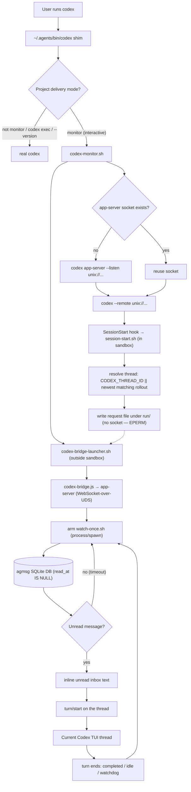

# Codex Monitor Beta

Codex does not expose Claude Code's Monitor tool. agmsg's Codex monitor beta
approximates the same experience by launching Codex through an app-server bridge.

> ⚠️ **Experimental beta — read before enabling.** This changes how Codex starts.
> Enabling monitor mode installs a shim at `~/.agents/bin/codex` and asks you to
> put `~/.agents/bin` **first on your PATH**, so `codex` then resolves to the shim
> instead of the real binary. In monitor-mode projects the shim re-routes
> interactive launches through an app-server bridge; everywhere else it passes
> straight through. **Only enable this if you understand PATH precedence and are
> comfortable with the `codex` command being intercepted.** It also depends on
> Codex app-server behavior and may break as Codex changes. Known rough edges:
> enabling monitor takes effect only after you **restart Codex and send your
> first message** — the SessionStart hook fires on the first turn, not the
> moment Codex opens, so the bridge is absent until you interact once; an
> already-running session stays unmonitored until you restart it (#151); the
> bridge is not torn down when you close the TUI (orphans linger until reboot
> or `mode off`/manual kill, see #149); and only one Codex identity per project
> is supported (#150).

## Quick Start

Enable monitor mode in a project:

```bash
~/.agents/skills/agmsg/scripts/delivery.sh set monitor codex "$PWD"
```

The command:

1. Enables agmsg's Codex SessionStart/SessionEnd hooks for the project.
2. Installs a Codex shim at `~/.agents/bin/codex` when it is safe to do so.
3. Prints PATH instructions if `~/.agents/bin` is not before the real Codex
   binary.

The Codex sandbox must allow writes to the installed skill's runtime state:

```text
~/.agents/skills/<cmd>/db
~/.agents/skills/<cmd>/teams
~/.agents/skills/<cmd>/run
```

`install.sh` and `install.sh --update` add these writable roots to
`~/.codex/config.toml` when that file exists.

If the command says `~/.agents/bin` is not on PATH, add this to your shell
profile:

```bash
export PATH="$HOME/.agents/bin:$PATH"
```

Restart the shell, then launch Codex normally:

```bash
codex
```

In monitor-mode projects, the shim routes interactive Codex launches through
the bridge. Outside monitor-mode projects, it passes through to the real Codex.

## Fallback

If `~/.agents/bin/codex` already exists and is not the agmsg shim, agmsg leaves
it untouched. You can either move that command aside and run `mode monitor`
again, or launch monitor sessions explicitly:

```bash
~/.agents/skills/agmsg/scripts/codex-monitor.sh
```

For custom command names, replace `agmsg` with the installed skill name:

```bash
~/.agents/skills/<cmd>/scripts/codex-monitor.sh
```

## What The Shim Does

The shim only wraps interactive Codex TUI launches:

```bash
codex
codex resume
codex "fix this bug"
```

Noninteractive subcommands pass through to the real Codex binary:

```bash
codex exec ...
codex app-server ...
codex login
codex logout
```

The shim also passes through when the current project is not in Codex monitor
mode.

## Bridge Mechanics

`codex-monitor.sh` starts (or reuses) an agmsg-managed Codex app-server socket
under `~/.agents/skills/<cmd>/run/`, starts the out-of-sandbox bridge launcher,
and then connects the Codex TUI to that socket with `--remote`.

Codex fires the SessionStart hook on the session's **first turn** (the first
message you send), not the moment the TUI opens — so the bridge does not exist
until you interact once after a restart.

The SessionStart hook is designed to **not** start the bridge directly — a
hook-launched process was observed to run inside the Codex sandbox and fail to
connect to the unix socket (EPERM). Instead:

> Note: this EPERM-avoidance design (the launcher + request-file rendezvous
> below) is under review — in practice the hook has been seen to launch a
> detached bridge directly and connect fine, suggesting the launcher layer may
> be redundant. See #153.

1. `session-start.sh` (the hook) resolves the thread id — `CODEX_THREAD_ID` when
   set, otherwise the newest Codex rollout whose `session_meta` cwd matches the
   project (fresh / `codex exec` sessions never export `CODEX_THREAD_ID`) — and
   writes a **request file** under `run/` (it never touches the socket).
2. `codex-bridge-launcher.sh`, started by `codex-monitor.sh` **outside** the
   sandbox, reads the request file and starts `codex-bridge.js`.
3. The bridge connects to the same app-server over **WebSocket-over-UDS**,
   resumes the thread, and arms `watch-once.sh` via the app-server `process/spawn`
   API (which polls the agmsg DB for unread rows, `read_at IS NULL`).
4. On an unread message it inlines the text into a `turn/start` on that thread —
   surfacing it in the live Codex TUI — then re-arms after the turn ends.

Turns are serialized (one per thread): a message that arrives while a turn is
running stays unread and is delivered after the turn completes. The turn ends
via `turn/completed`, a `thread/status` idle, or a watchdog (the real app-server
does not reliably send `turn/completed`); only then is the next `watch-once`
armed. If a turn does not consume the unread message, the same `max_id` reappears
and the bridge stops instead of looping.



## Related Details

- [Delivery modes](../README.md#delivery-modes)
- [Codex bridge implementation](../scripts/codex-bridge.js)
- [Monitor launcher](../scripts/codex-monitor.sh)
- [Codex shim](../scripts/codex-shim.sh)
