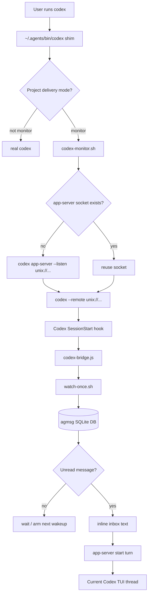

# Codex Monitor Beta

Codex does not expose Claude Code's Monitor tool. agmsg's Codex monitor beta
approximates the same experience by launching Codex through an app-server bridge.

This feature is experimental. It depends on Codex app-server behavior and may
need adjustment as Codex changes.

## Quick Start

Enable monitor mode in a project:

```bash
~/.agents/skills/agmsg/scripts/delivery.sh set monitor codex "$PWD"
```

The command:

1. Enables agmsg's Codex SessionStart/SessionEnd hooks for the project.
2. Installs a Codex shim at `~/.agents/bin/codex` when it is safe to do so.
3. Prints PATH instructions if `~/.agents/bin` is not before the real Codex
   binary.

The Codex sandbox must allow writes to the installed skill's runtime state:

```text
~/.agents/skills/<cmd>/db
~/.agents/skills/<cmd>/teams
~/.agents/skills/<cmd>/run
```

`install.sh` and `install.sh --update` add these writable roots to
`~/.codex/config.toml` when that file exists.

If the command says `~/.agents/bin` is not on PATH, add this to your shell
profile:

```bash
export PATH="$HOME/.agents/bin:$PATH"
```

Restart the shell, then launch Codex normally:

```bash
codex
```

In monitor-mode projects, the shim routes interactive Codex launches through
the bridge. Outside monitor-mode projects, it passes through to the real Codex.

## Fallback

If `~/.agents/bin/codex` already exists and is not the agmsg shim, agmsg leaves
it untouched. You can either move that command aside and run `mode monitor`
again, or launch monitor sessions explicitly:

```bash
~/.agents/skills/agmsg/scripts/codex-monitor.sh
```

For custom command names, replace `agmsg` with the installed skill name:

```bash
~/.agents/skills/<cmd>/scripts/codex-monitor.sh
```

## What The Shim Does

The shim only wraps interactive Codex TUI launches:

```bash
codex
codex resume
codex "fix this bug"
```

Noninteractive subcommands pass through to the real Codex binary:

```bash
codex exec ...
codex app-server ...
codex login
codex logout
```

The shim also passes through when the current project is not in Codex monitor
mode.

## Bridge Mechanics

`codex-monitor.sh` starts or reuses an agmsg-managed Codex app-server socket
under:

```text
~/.agents/skills/<cmd>/run/
```

It then connects the Codex TUI to that socket with `--remote`. Codex's
SessionStart hook starts `codex-bridge.js` in the background. The bridge:

1. Runs `watch-once.sh` through the app-server `process/spawn` API.
2. Waits for unread agmsg messages addressed to this Codex identity.
3. Inlines unread inbox text into a Codex turn.
4. Starts a Codex turn on the current app-server thread.

If a started turn does not consume the unread message, the same unread
`max_id` remains pending. The bridge detects that unchanged wakeup and stops
instead of starting an infinite turn loop.



## Related Details

- [Delivery modes](../README.md#delivery-modes)
- [Codex bridge implementation](../scripts/codex-bridge.js)
- [Monitor launcher](../scripts/codex-monitor.sh)
- [Codex shim](../scripts/codex-shim.sh)
